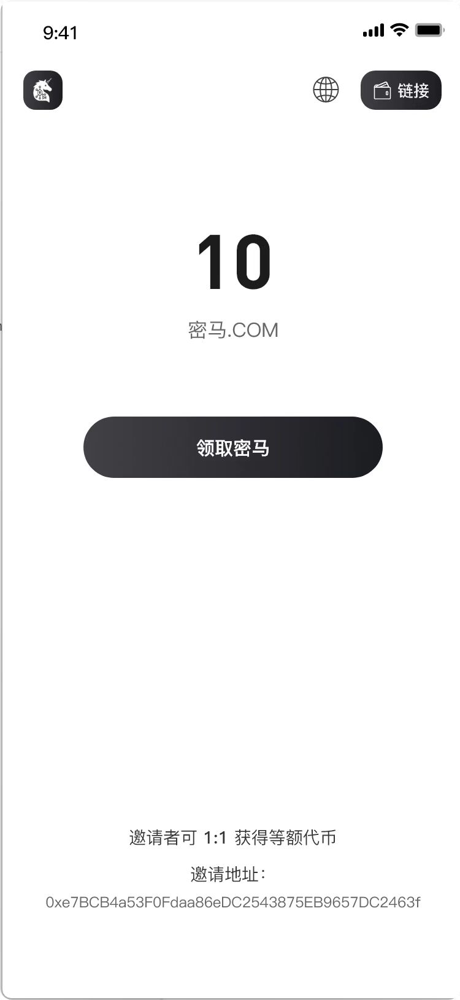
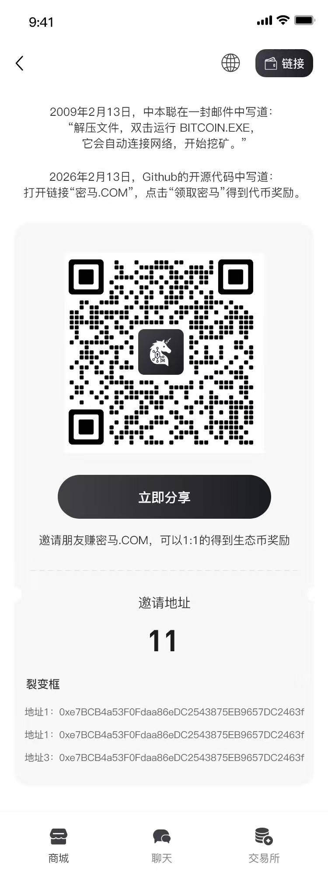

[English](./README.md) | [简体中文](./README.zh-CN.md)

# AirdropGroup Contracts

One-time Merkle airdrop claim with permanent inviter binding, on-chain group join, and **OZT Proof** (issuer has no token minting rights).

## Table of Contents

- [Overview](#overview)
- [OZT Proof](#ozt-proof)
- [Architecture](#architecture)
- [Contract Reference](#contract-reference)
- [Usage Flow](#usage-flow)
- [Security](#security)

## Overview

The AirdropGroup module provides:

- **One-time claim**: Each address in the Merkle tree may claim once; leaf = `keccak256(abi.encode(account))`.
- **Inviter binding**: At claim time the user may bind an inviter; the binding is permanent (first bind wins).
- **Dual rewards**: Claimer and inviter both receive token rewards via `OZTToken.mintByClaim`.
- **On-chain group join**: After claim, both claimer and inviter are added to the **MerkelGroup Community** (see below) via `ICommunityClaimJoin.claimJoin(address)`.
- **OZT-compliant minting**: Only the claim contract can mint; token owner can renounce/transfer to burn address so the project has no minting power.

Optional controls: blacklist, max invitees per inviter (0 = unlimited), and Merkle root freeze (irreversible).

---

## OZT Proof

**OZT (Zero Token control by issuer)** is a proof system that demonstrates **the project has no token issuance rights**. It relies on Merkle trees, on-chain fixation of the root, and permanent renunciation of mint/owner authority.

### Definition

OZT Proof is a **cryptographic and on-chain** guarantee that:

1. Eligibility is defined only by a **Merkle root** (derived from a public snapshot).
2. The root is **fixed on-chain** and can be **frozen** so it cannot be changed.
3. **Only the claim contract** can mint, and it mints only to addresses that prove inclusion in the Merkle tree (and optionally to their inviters).
4. The **token owner** can transfer ownership to a burn address, so no central party retains mint or admin power.

Together, this ensures fair, rule-based distribution with no backdoor issuance.

### Five-Layer Logic (summary)

1. **Merkle binding**: The Merkle root has a unique mapping to the set of leaves. Changing a single address in the snapshot changes the root; the snapshot cannot be altered without detection.
2. **Snapshot → root**: A snapshot (e.g. “all addresses with ≥ $100 on BSC”) is turned into a Merkle tree; the root is the public commitment to that set.
3. **Public verification**: The full leaf list (or tree data) can be published (e.g. on GitHub). Anyone can recompute the root and compare it to the value stored on-chain.
4. **Root on-chain**: The verified root is set (and optionally frozen) in the claim contract on a public chain (e.g. BSC), so the eligibility rule is immutable and auditable.
5. **No issuer control**: The token contract’s owner is transferred to a burn address (or renounced). The only minter is the claim contract, which only mints to provable snapshot addresses (and their invitees). The project gives up all mint and admin rights.

### Verification Loop

The community can verify OZT without trusting the project:

1. Download the Merkle tree file (e.g. from GitHub).
2. Compute the Merkle root locally.
3. Compare it to the root stored in the claim contract (and check that the root is frozen if applicable).
4. Confirm the token contract owner is a burn address (or renounced).
5. Confirm that minting is restricted to the claim contract and that the claim contract only mints for valid Merkle proof (and inviter rewards).

All steps are independently verifiable on-chain and from public data.

### Value

- **Decentralized issuance**: Only on-chain rules and snapshot-derived Merkle proofs determine who can receive tokens; no single party can mint at will.
- **Cryptographic fairness**: The snapshot and the root are bound; eligibility is objective and tamper-evident.
- **Rigid supply**: Total minted is bounded by the number of eligible claimers and the fixed reward per claim (and per inviter). Once the root is frozen and owner is burned, the cap is enforced by the contract.

---

## Architecture

### Contracts

| Contract        | Role |
|----------------|------|
| **OZTToken**   | ERC20 token; only `claimContract` can mint via `mintByClaim`. Owner can be set once to claim contract, then transferred to burn address. |
| **AirdropClaim** | Holds Merkle root (set once, optionally frozen). Users claim with Merkle proof; optional inviter binding; mints to claimer and inviter; calls `ICommunityClaimJoin.claimJoin` for both. |

### Interfaces

- **IOZTToken**: `mintByClaim(to, amount)`, `setClaimContractOnce(claimContract_)`.
- **ICommunityClaimJoin**: `claimJoin(account)` — called so claimer and inviter join an on-chain group.

### Group joined after claim (MerkelGroup Community)

The community contract that receives claimers and inviters is the **MerkelGroup [Community](../MerkelGroup/Community.sol)**. In that contract:

- **`claimJoin(address account)`** adds `account` as a member with the community’s maximum tier in the current epoch. It is callable only by addresses in the **claim operator** list (`onlyClaimOperator`).
- The Community owner must call **`setClaimOperator(airdropClaimAddress, true)`** so that the AirdropClaim contract is allowed to call `claimJoin`. Without this, `AirdropClaim.claim` would revert when it tries to add the claimer and inviter to the community.

So: after a successful claim, both the claimer and the inviter are added to that Community group (same one used for Merkle-based join and rooms).

### Deployment Order

1. Deploy **OZTToken** (name, symbol, initialOwner).
2. Deploy **AirdropClaim** (owner, token, community, merkleRoot), where `community` is the MerkelGroup **Community** address.
3. On the **Community** contract: call **setClaimOperator**(airdropClaimAddress, true) so AirdropClaim can call `claimJoin`.
4. On OZTToken: call **setClaimContractOnce**(airdropClaimAddress).
5. On AirdropClaim: set Merkle root if not set in constructor; optionally **freezeMerkleRoot**.
6. (Optional) Transfer OZTToken **owner** to burn address so no one can change claim contract or mint.

### Images

**Claim flow**

**Invite flow**

---

## Contract Reference

### AirdropClaim

- **Constructor**: `(initialOwner, token_, community_, merkleRoot_)` — `token_` is OZTToken, `community_` is the MerkelGroup Community (must have AirdropClaim set as claim operator via `Community.setClaimOperator`); `merkleRoot_` can be `bytes32(0)` and set later once.
- **Claim**: `claim(proof, inviter)` — `proof` is Merkle proof for `msg.sender` (leaf = `keccak256(abi.encode(msg.sender))`); `inviter` can be `address(0)`. First successful claim binds inviter permanently; claimer and inviter get rewards and `community.claimJoin` is called for both.
- **Admin**: `setMerkleRoot` (only before any root was set and before freeze), `freezeMerkleRoot`, `setCommunity`, `setBlacklist`, `setInviterLimit`, `rescueERC20`.
- **Views**: `merkleRoot()`, `isClaimed(account)`, `inviterOf(invitee)`, `inviteeCount(inviter)`, `getInvitees(inviter, offset, limit)`.

### OZTToken

- **Constructor**: `(name_, symbol_, initialOwner)`.
- **One-time**: `setClaimContractOnce(claimContract_)` — only the claim contract can call `mintByClaim` after this.
- **Minting**: `mintByClaim(to, amount)` — only callable by `claimContract` (set above).

---

## Usage Flow

1. **Off-chain**: Build snapshot of eligible addresses; build Merkle tree; publish leaf list/tree (e.g. GitHub); compute root.
2. **On-chain**: Set root in AirdropClaim (or pass in constructor); optionally freeze root; ensure OZTToken has `claimContract` set and, for full OZT, transfer token owner to burn address.
3. **User**: Get Merkle proof for their address; call `claim(proof, inviter)`; receive token reward; inviter receives reward; both are joined to the community via `claimJoin`.

---

## Security

- **One claim per address**: Enforced by `_claimed` in AirdropClaim.
- **Merkle root**: Set once; optional freeze prevents any future change.
- **Inviter binding**: Immutable after first claim; prevents inviter gaming.
- **Mint authority**: Only AirdropClaim can mint OZTToken after `setClaimContractOnce`; AirdropClaim mints only to claimer and inviter according to fixed rules. Renouncing/transferring token owner to burn address removes all project-side control (OZT).
